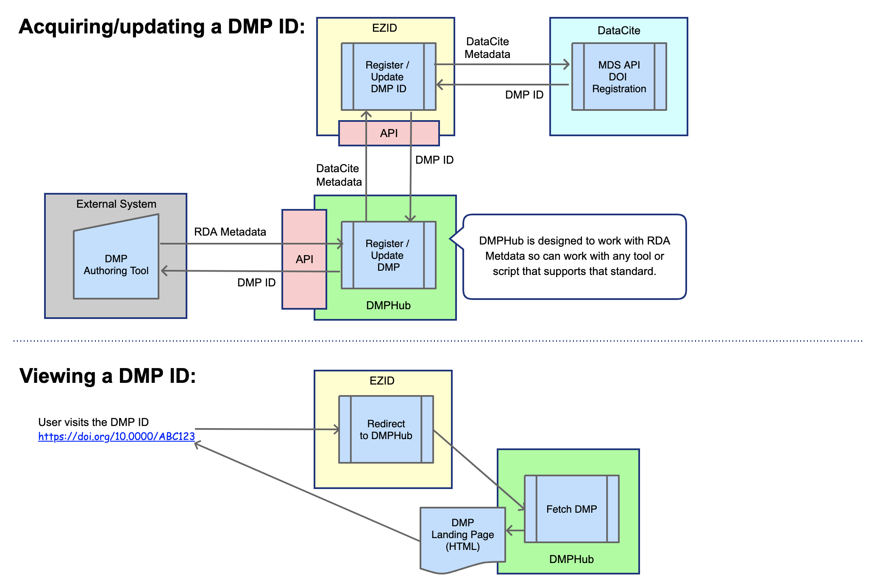

# DMPHub


## Overview

The DMPHub is a metadata repository for Data Management Plans (DMP). It can gather DMP metadata from many different sources and can be extended to interact with other APIs to collect/harvest additional metadata to enhance or refine the DMP record (e.g. grant IDs, journal articles, datasets, etc.).


The DMPHub serves two primary purposes:
1. To host a public landing page for the DMP ID (see below)
2. Act as a proxy between an external system and EZID for the purpose of acquiring DMP IDs



The DMPHub does not currently pro vide any UI pages to allow a user to add or edit DMP metadata. All management of DMP metadata is meant to be performed via it's API.

The DMPHub provides an API that communicates via the new metadata standard developed by an RDA working group called the [RDA common standard for machine-actionable data management plans](https://rda-dmp-common.github.io/RDA-DMP-Common-Standard/).

See the [Wiki](https://github.com/CDLUC3/dmphub/wiki) for more information on the API.

## What is a DMP ID

A DMP ID is a unique persistent identifier for a data management plan. The exact format of the DMP ID can change depending on the minting authoriy used (e.g. DOI, ARK, etc.).

DataCite will begin providding support for DMP IDs in schema 4.4. Once released, you will be able to query [DataCite's EventData](https://datacite.org/eventdata.html) API to discover other identifiers related to a DMP.

## Security

The DMPHub uses the concept of ApiClients. There is no admin UI interface at this time, so you must add records manually to the `api_clients` table in order to provide access for an external system. You must also add a corresponding record to the `provenances` and `api_client_permissions` tables for each ApiClient.

We recommend running `rails sceret` to generate a unique identifier for your `client_id` and `client_secret` entries.

Example api_clients record:
```yaml
name: 'dmphub'   # Required - should be lowercase and MUST match the corresponding provenance record
description: 'Local account used for testing' # Optional
hompage: 'https://dmphub.example.org' # Optional
contact_name: 'Jane Doe' # Optional
contact_email: 'jane.doe@example.org' # Required
client_id: 'my_client_id'
client_secret: 'my_client_secret'
last_access: '2021-03-01 10:30:23' # Maintained and updated by the API code
```

Example api_client_permissions record (note that permission 1 & 2 have not yet been implemented):
```yaml
api_client_id: 1
permission: 0 # 0 = data_management_plan_creation, 1 = funding_assertion 2 = contributor_assertion
```

Example provenances record:
```yaml
name: 'dmphub' # Required - should be lowercase
description: 'Local account used for testing' # Optional
```

The DMPHub controls which users/systems can modify a DMP's record through the `api_client_authorizations` table. By default, the ApiClient that creates the DMP has full access to make modifications to that DMP.

See the API documentation on the Wiki for more details on API authentication and authorization.

## Versioning

The DMPHub does not officially version a DMP's metadata. It relies on the original system that sent it the created the DMP to maintain proper versions and to notify the DMPHub when a new version is available.

A system can convey that it is sending a new version through the `modified` date on the incoming JSON record.

The DMPHub does however record all changes for simple debugging purposes. It stores these changes in the `alterations` table. An alteration record contains the type of object (e.g. DataManagementPlan, Affiliation, etc.), it's record id, and the change log. The change log is a hash of fields with 2 entries, the original value and the new value. For example:
```yaml
alterable_id: 123
alterable_type: 'Contributor'
change_log: { "name": ["John Doe", "John Doe PhD"], "affiliation_id": [12, 98] }
provenance: 1
```

## Funding

Original funding for the DMPHub was provided by an [NSF EAGER grant](https://www.nsf.gov/awardsearch/showAward?AWD_ID=1745675&HistoricalAwards=false) for work surrounding machine-actionable DMPs (maDMPs)

## Feedback

We welcome any and all feedback. Please use Github Issues to provide suggestions or to report a bug, and a PR if if you wish to contribute.

## Get Involved

We welcome collaborators and anyone wishing to use or extend the code.

## Requirements
- ruby 2.6.6

## Installation

- Clone this repository
- Generate your credentials by running `EDITOR=vi rails credentials:edit` which will open the default credentials file. Copy the contents of that file and then run `EDITOR=vi rails credentials:edit -e development` and once again for 'production' and any other environments you want to support. Paste the default credentials into these new files and update the content accordingly. This will generate 2 files per environment and place them in `config/credentials/`. By default, the `config/credentials/[environment].key` files are ignored by github. You will need to make sure you store these keys in a secure place and then copy them into the directory when you deploy.
- Run `bundle install`
- Run `yarn install`
- Run `bundle exec rake db:setup`
- Run `bundle exec rake initialize:all`. This will generate the super user account (forthcoming) and an API client account for the DMPHub itself along with all of the default provenance records.
- Run `rails s` to start the application

Once the application is up and running you can do the following to ensure that the API is functional:
- run `curl -v http://localhost:3000/api/v0/heartbeat`. This should return a 200 response.
- run `rails "api_tester:verify[http://localhost:3000,dmphub,1234567890,0987654321]"`. (This assumes you have not changed the client_id and client_secret for the default app). This will attempt to authenticate the 'dmphub' ApiClient and then fetch the list of DMPs which will be empty at this stage.

Once you have confirmed that the site is operational you can follow the API instructions in the Wiki to start adding DMPs.

You can use the code in `lib/tasks/utils/api_tester.rake` as an example for accessing the DMPHub's API.

**Don't forget to change the client_id and client_secret for the default dmphub ApiClient!**
